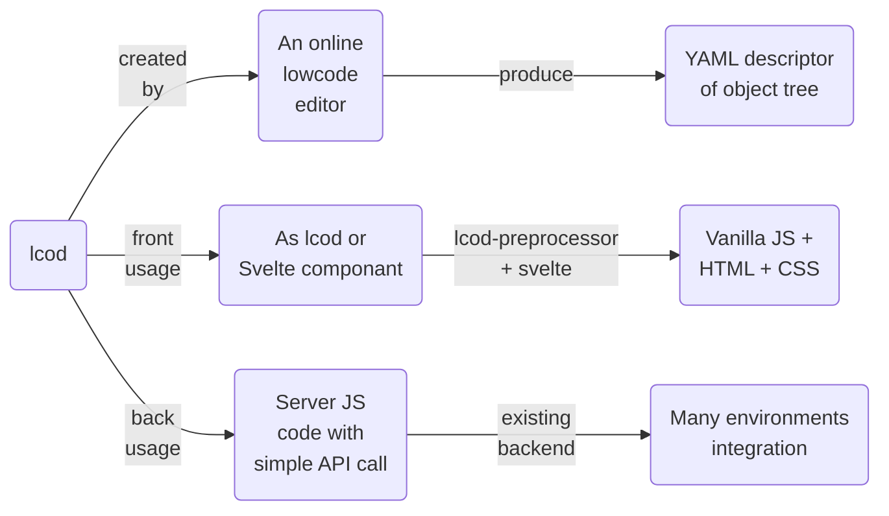

# LocCode Object Descriptor
## Big picture

```mermaid
---
Low Code Object Descriptor
---
flowchart LR
    A(lcod) -->|created\nby| B(An online\nlowcode\neditor)
    B -->|produce| B2(YAML descriptor\nof object tree)
    A --> |front\nusage| C(As lcod or\nSvelte componant)
    C --> |lcod-preprocessor\n+ svelte| C2(Vanilla JS +\nHTML + CSS)
    A --> |back\nusage| D(Server JS\ncode with\nsimple API call)
    D --> |existing\nbackend| D2(Many environments\nintegration)
```
