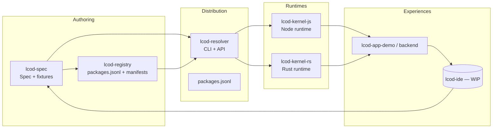

# Build With LCOD

**LCOD (Low‑Code On Demand)** est une plateforme "compose‑first" : on assemble des applications à partir de blocs réutilisables plutôt que d'écrire du code glue. Chaque composant embarque schémas, docs et tests ; un noyau minimal les exécute sur plusieurs runtimes ; une registry Git et un resolver assurent la traçabilité et la reproductibilité.

## Piliers

- **Spécification d'abord** – `lcod-spec` définit `lcp.toml`, le DSL `compose`, les fixtures et les helpers communs.
- **Kernels portables** – `lcod-kernel-js` (Node) et `lcod-kernel-rs` (Rust) partagent la même sémantique d’exécution.
- **Distribution Git-native** – `lcod-registry` publie manifests + catalogue (`packages.jsonl`, `registry.json`) pour résoudre, vérifier et mettre en cache les blocs.
- **Tooling composable** – `lcod-resolver` exprime le pipeline de résolution en LCOD ; les scripts CI/CLI réutilisent les mêmes composants.
- **Assistance design-time** – IDE + RAG (en cours) pour aider humains et agents à chercher, assembler et valider les flows avant déploiement.

## Carte de l’écosystème

## Repos clefs

| Repository | Rôle | Statut |
| --- | --- | --- |
| [`lcod-spec`](https://github.com/lcod-team/lcod-spec) | Spécification, schémas, helpers, fixtures | Actif (roadmap M5 registry) |
| [`lcod-registry`](https://github.com/lcod-team/lcod-registry) | Registry Git (catalogue + automation) | Bootstrap terminé |
| [`lcod-kernel-js`](https://github.com/lcod-team/lcod-kernel-js) | Runtime Node/TypeScript | Parité spec + registry helpers |
| [`lcod-kernel-rs`](https://github.com/lcod-team/lcod-kernel-rs) | Runtime Rust | Parité spec + registry helpers |
| [`lcod-resolver`](https://github.com/lcod-team/lcod-resolver) | CLI resolver compose-first | Refacto en cours |
| [`lcod-app-demo`](https://github.com/lcod-team/lcod-app-demo) | Démos et apps de référence | WIP |
| [`lcod-assets`](https://github.com/lcod-team/lcod-assets) | Logos & visuels | Stable |

## Prochaines étapes

- Durcir la registry : validation de hash/signature, miroir GitHub Pages, artefacts `.lcpkg`.
- Enrichir le catalogue de helpers (core, adapters) et publier la matrice de compatibilité.
- Proposer une preview de l’IDE LCOD (RAG + édition compose en live).
- Étendre la pipeline assemble → ship → build sur plusieurs langages.

👉 Suivez les roadmaps de chaque repo pour les milestones détaillés ou passez sur les Issues/Discussions pour contribuer.
