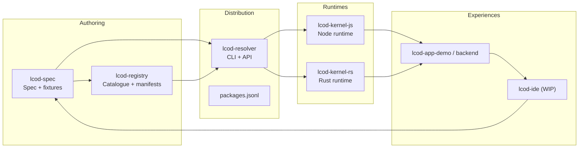

# Build With LCOD

**LCOD (Low‑Code On Demand)** is a compose-first platform: applications are assembled from reusable components instead of glue code. Every block ships with schemas, docs, and tests; a lightweight kernel runs those blocks across runtimes; a Git-native registry and resolver keep delivery reproducible.

## Pillars

- **Specification first** – `lcod-spec` defines `lcp.toml`, the `compose` DSL, shared fixtures, and helper components.
- **Portable kernels** – `lcod-kernel-js` (Node) and `lcod-kernel-rs` (Rust) share identical execution semantics.
- **Git-native distribution** – `lcod-registry` publishes manifests and the generated catalogue (`packages.jsonl`, `registry.json`) so clients can resolve, verify, and cache components.
- **Composable tooling** – `lcod-resolver` expresses the resolution pipeline in LCOD; CI/CLI scripts reuse the same helpers.
- **Design-time assistance** – the upcoming IDE + RAG stack helps humans (and agents) search, assemble, and validate flows before shipping.

## Ecosystem Map

## Key Repositories

| Repository | Role | Status | CI |
| --- | --- | --- | --- |
| [`lcod-spec`](https://github.com/lcod-team/lcod-spec) | Specification, schemas, helpers, fixtures | Active (registry roadmap in progress) |  |
| [`lcod-registry`](https://github.com/lcod-team/lcod-registry) | Git registry (catalog + automation) | Bootstrap complete | — |
| [`lcod-kernel-js`](https://github.com/lcod-team/lcod-kernel-js) | Node/TypeScript runtime & SDK | Spec parity + registry helpers wired |  |
| [`lcod-kernel-rs`](https://github.com/lcod-team/lcod-kernel-rs) | Rust runtime & SDK | Spec parity + registry helpers wired |  |
| [`lcod-resolver`](https://github.com/lcod-team/lcod-resolver) | Compose-first resolver CLI | Refactor ongoing |  |
| [`lcod-components`](https://github.com/lcod-team/lcod-components) | Shared LCOD components & helpers | Standard library rollout |  |
| [`lcod-app-demo`](https://github.com/lcod-team/lcod-app-demo) | Reference applications & samples | WIP | — |
| [`lcod-assets`](https://github.com/lcod-team/lcod-assets) | Logos & shared visuals | Stable | — |

## What’s Next

- Harden the registry: hash/signature validation, GitHub Pages mirror, `.lcpkg` artefacts.
- Enrich the helper catalogue (core contracts, adapters) and publish compatibility matrices.
- Ship the LCOD IDE preview (RAG integration + live compose editing).
- Expand the assemble → ship → build pipeline across languages.

👉 Follow each repo’s roadmap for milestones, or jump into Issues/Discussions to help shape the next components.
