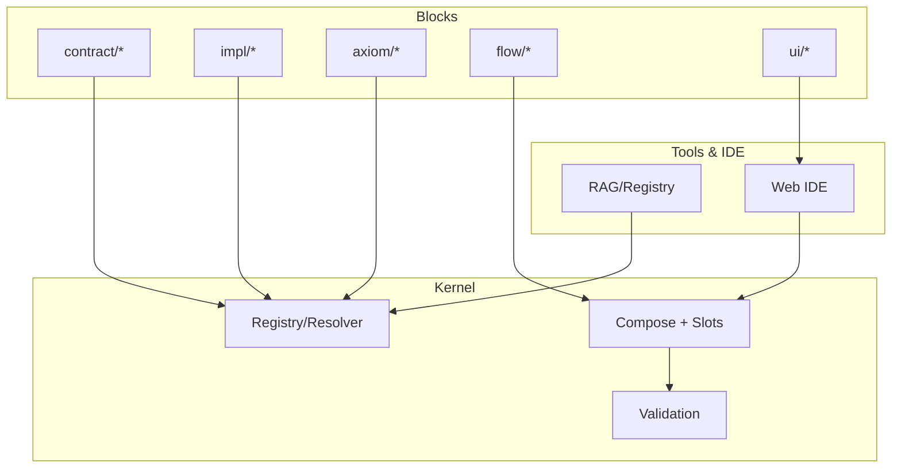

## LCOD — Short Overview

LCOD is a component system to design apps by composing reusable blocks rather than writing bespoke code. Blocks are identified by canonical URIs and packaged with schemas and docs. A minimal kernel resolves contracts to implementations, executes flows with named slots, and validates inputs/outputs.

Big picture



- Contracts vs Implementations — Compositions reference `contract/*`; bindings select `impl/*` per environment and are locked for reproducibility.
- Slots and Scopes — Flow blocks (if/foreach/parallel/try) orchestrate child steps via slots. Default slot is `children`.
- SDK API — Custom flow components use a kernel API (planned) like `ctx.runChildren()` / `ctx.runSlot()` to invoke their slots.

Read the full specification overview in lcod-spec/OVERVIEW.md.

```json
{
  "name": "happy_path",
  "input": {},
  "expect": { "tempC": 28 },
  "mocks": {
    "axiom.http.get": {
      "https://whatcity.com?loc=48.85,2.35": { "status": 200, "body": "{\"city\":\"Paris\"}" },
      "https://weather.com?city=Paris": { "status": 200, "body": "{\"tempC\":28}" }
    },
    "axiom.gps.read": { "gps": "48.85,2.35" }
  }
}
```

## 5. Registry and Resolver

To enable reuse and versioning, LCOD uses a **Git‑based registry** combined with a flexible **resolver**.  Components are stored in a repository where each block lives in its own folder under `namespace/name/`.  Consumers refer to blocks by canonical URI and configure a resolver with mirror and replacement rules.

**Resolver configuration example (`resolver.toml`):**

```toml
[mirrors]
"lcod://core" = "https://raw.githubusercontent.com/myorg/lcod-registry/main/core"

[replace]
"lcod://core/http_get@1" = "https://git.internal.example.com/core/http_get#v1.2.3"
"lcod://ui/login_card@*" = "file:///home/company/internal_blocks/ui/login_card"

[allow]
namespaces = ["core", "company", "demo"]

[cache]
dir = ".lcod-cache"
verifyIntegrity = true
```

The resolver operates as follows:

1. **Normalization** – resolves a canonical URI with an optional version range (e.g. `lcod://core/weather@^1`) to a concrete version.
2. **Substitution** – applies `replace` rules to redirect to custom locations or forks.
3. **Mirroring** – applies `mirrors` rules to change base URLs for entire namespaces.
4. **Fetching** – downloads `lcp.toml`, followed by standard files (README, schemas, impl, tests).  If files have non‑standard names, the resolver consults an optional `index.json` in the package.
5. **Integrity & signature** – checks SHA‑256 hashes and optional signatures (sigstore) declared in the descriptor.  Resolved packages can be stored in an offline cache.
6. **Lockfile** – generates an `lcp.lock` listing all resolved components and their concrete sources for reproducible builds.

## 6. Kernel and Runtime

The kernel library provides the core execution model.  A block can be of three types:

1. **Axiom** – primitive functions built into the SDK (e.g. `http_get`, `parse_json`, `gps_read`).  They are provided by the substrate and are not implemented in the component.
2. **Native** – blocks that already have an implementation in the target language (e.g. a Java method, a Rust function).  The `impl/<lang>/` folder supplies source code for these.
3. **Composite** – blocks whose behaviour is defined via the `compose` DSL.  The kernel executes children, maps inputs and outputs, and merges the results.

All blocks carry input and output schemas that the kernel validates at runtime.  If the implementation does not exist for a native block, a generator can synthesize a wrapper that calls the children via the kernel’s context API:

```ts
export const weather: Func = async (ctx, input) => {
  const { body, status } = await ctx.call("http_get", { url: `https://weather.com?city=${input.city}` });
  if (status !== 200) throw new Error("Failed to fetch weather");
  const { tempC } = await ctx.call("parse_json", { raw: body });
  return { tempC };
};
```

The kernel supports concurrency and resource management based on hints (timeouts, retries, idempotence).  For example, parallel execution of independent children is possible when no data dependency exists.

## 7. Design‑Time Assistance with RAG

An LLM can help designers search and assemble blocks at design time.  To do so it queries a **RAG index** built from the registry:

1. **Index** – All descriptors, documentation and schemas are chunked and embedded into a vector database (e.g. pgvector).  Each entry stores the block ID, summary, keywords, field names, and other metadata.
2. **Search** – The IDE’s palette includes a semantic search bar.  When the user types “login card with Google and Microsoft OAuth”, the RAG returns candidate blocks with scores (e.g. `ui.login_card`, `service.oauth_google`, `service.oauth_microsoft`).
3. **Insertion** – The LLM suggests a composition and fills in the `props` for the UI block and the `in` mappings for children.  It can also create new blocks by following the spec and tests.
4. **Validation** – The kernel’s schema validation and tests ensure that the proposed composition is correct.  Errors and hints are returned to the LLM for self‑correction.

## 8. IDE and Graphical Editor

An IDE built on LCOD presents two synchronized views: a **tree view** showing the hierarchical slots/children and a **flow view** showing the data/trigger graph.  A palette lists available blocks (filtered by compatibility) and can search with RAG.  An inspector panel displays the editable properties of the selected block, generated from its input schema and hints.  When a UI block implements `[ui]`, the IDE can render a live preview using the provided preview component and props schema.  The IDE persists the project descriptor (`lcp.toml` + `compose.json`) and generates code on demand.

## 9. Distribution and Extensibility

LCOD supports packaging flows as libraries for different languages, as full applications or as microservices.  The resolver and kernel allow replacing blocks with internal versions (for enterprise use), mirroring registries and verifying integrity.  Blocks can declare UI metadata (`[ui]`) and events (AsyncAPI/CloudEvents) for reactive architectures.  Additional layers (HTTP, gRPC, GraphQL, CLI) can be built as adapters without modifying the core.  Future extensions might include support for WebAssembly for sandboxed execution, type guards for generics, and multi‑agent coordination.

## 10. Repository Organization

A recommended polyrepo layout for the LCOD ecosystem:

| Repository       | Purpose                                      |
| ---------------- | -------------------------------------------- |
| `lcod-spec`      | Specification, schemas, examples, docs.      |
| `lcod-kernel-js` | JavaScript/TypeScript kernel + SDK implementation. |
| `lcod-registry`  | Git registry of LCP components.              |
| `lcod-resolver`  | CLI and library to resolve and cache blocks. |
| `lcod-adapters`  | HTTP/JSON‑RPC/MCP adapters (optional).       |
| `lcod-ide`       | Graphical IDE (future work).                 |

It is useful to place a **high‑level overview** like this document in the root of the organization (e.g. `lcod-team/README.md`) so that contributors and agents have immediate context.  More detailed specs and API references can reside in `lcod-spec/docs/`.

## 11. Conclusion

LCOD aims to provide a solid foundation for low‑code development with AI‑assisted design and native‑quality runtime.  By standardizing the structure of components (`lcp.toml`), enforcing explicit dataflow (`compose`), and keeping the kernel minimal, it allows developers to mix and match reusable blocks across languages and platforms.  A resolver abstracts the source of blocks and ensures reproducibility.  A registry and RAG index make discovery and reuse practical.  Together, these pieces enable a scalable ecosystem where humans and AI collaborate to build robust applications efficiently.
